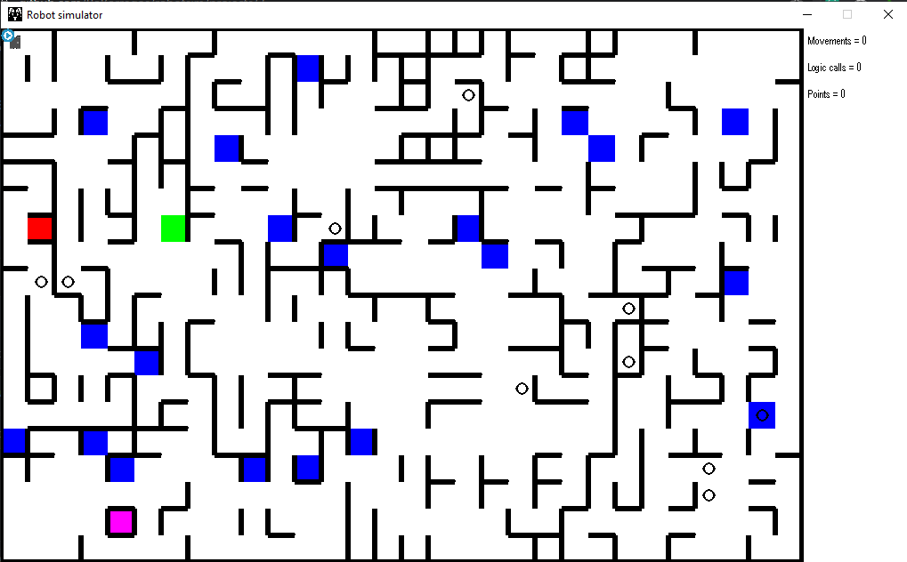

Última actualización: 18/04/2021

#

</br>
 

##
# **robotSim**

**robotSim** es un proyecto en desarrollo, así que le pedimos a los participantes del AT 2021 que estén atentos a cualquier aviso de actualización del programa. Igualmente, si hay cualquier duda no duden en contactarse con los programadores RoBorregos:

| Nombre | Correo | Github |
| ---- | ----- | ------ |
| José Cisneros | [A01283070@itesm.mx](mailto:A01283070@itesm.mx) | [@Josecisneros001](https://github.com/Josecisneros001) |
| Keven Arroyo | [A01283678@itesm.mx](mailto:A01283678@itesm.mx) | [@dake3601](https://github.com/dake3601) |
| Aurora Tijerina | [A01196690@itesm.mx](mailto:A01196690@itesm.mx) | [@AuroTB](https://github.com/AuroTB) |


## Acerca de este proyecto

El simulador fue adaptado específicamente para los retos del AT 2021. En esta versión, se tiene un entorno específico para el reto [Mace Race 2021](hola).

## Uso del simulador [TODO: agregar link de replit para que lo corran en web]

1. Clonar el repositorio del proyecto.

	SSH:

	```bash
	$ git clone git@github.com:RoBorregos/robotSim.git
	```

	o HTTPS:
	```bash
	$ git clone https://github.com/RoBorregos/robotSim.git
	```

2. Entrar al directorio del proyecto.

	```bash
	$ cd robotSim
	```

3. Instalar dependencias del simulador.
	
	```bash
	$ pip install -r requirements.txt
	```

3. Codificar movimientos del robot en main\_program.py

4. Simular Programa 
	```bash
	$ python robotsim.py
	```
    
## Información para developer 
El repositorio tiene los siguientes archivos en un folder:

- **main\_program.py:** script donde se programan los movimientos del robot.
- **robotsim.py:** script de inicialización y actualización del entorno de simulación.
- **resources/map.json:** descripción del mapa (test case).

Para correr el simulador, símplemente se debe de correr el comando:
```bash
	$ python robotsim.py
```

## Mapa



El mapa cuenta con las siguientes características:

- Paredes de color negro
- Baldosas de colores:
  - Rojo y verde: baldosas especiales (+25 puntos).
  - Azul: baldosas de puntos extra (+10 puntos).
  - Morado: Baldosa de salida.
- Objetos: círculos color negro.


## Funciones del robot

| **Función** | **Descripción** | **Input** | **Output** |
| --- | --- | --- | --- |
| robot.move\_forward() | Mueve el robot a la baldosa de enfrente | - | - |
| robot.rotate\_right() | Gira el robot 90° a la derecha | - | - |
| robot.rotate\_left() | Gira el robot 90° a la izquierda | - | - |
| robot.display_color(color) | Hace que el robot señale un color específico. | string ('blue', 'red', 'green') | bool (color identificado correctamente) |
| robot.grab\_obj() | Agarra el objeto frente a éste (si hay alguno)) | - | bool (objeto agarrado) |
| robot.finish\_round() | Termina la ronda. | - | - |
| robot.ultrasonic\_front() | Obtiene la distancia frente al robot en centímetros; si no detecta nada regresa -1 | int (número de cuadros libres frente al robot)|
| robot.getColor() | Obtiene el color de la baldosa en la que el robot se encuentra | - | string ('green','red','white', 'blue', 'purple') |
| robot.scan\_front() | Detecta si hay un objeto frente al robot. | - | bool (se detectó un objeto o no) |

## Importante

Cuando se escriba código en main\_program.py se tienen que tomar en cuenta los siguientes detalles:

- Todo el código debe realizarse dentro de la función main()
- Si creas una función, de debe colocar como una función anidada
- Si se declara una variable, debe declararse dentro de main().

Con suerte, esto se puede solucionar en el futuro, pero por el momento se debe de realizar así para evitar que el programa tenga errores.

Si se identifica cualquier bug por favor manden mensaje a los organizadores cprrespondientes del AT 2021.
